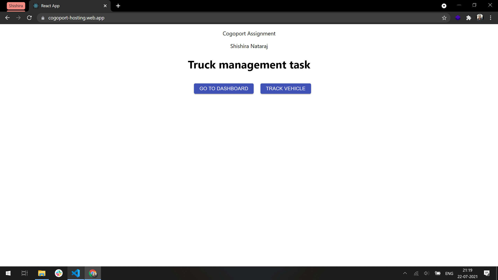
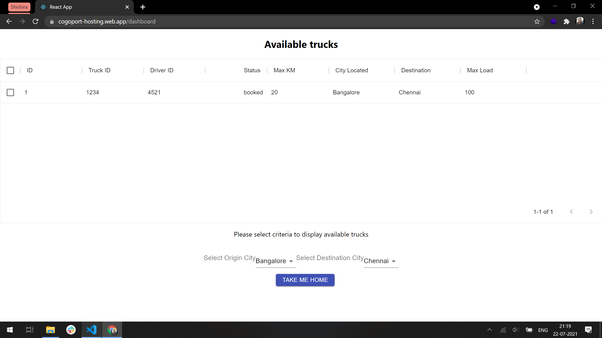
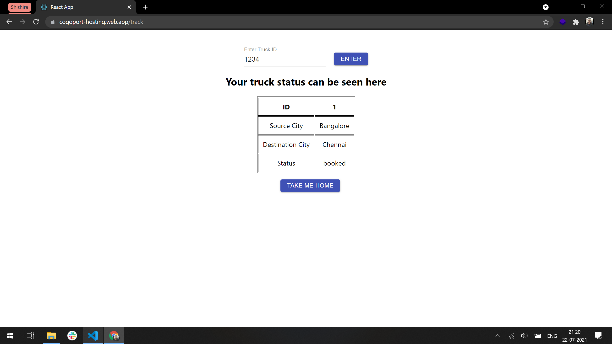

## About the Exercise/Assignment
This was a internship applicant assignment for Cogoport focused in the domain of frontend web development. The assignment is to search, book and track   a group of consignment vehicles. Here, from a list of trucks, we can look at the list of trucks, check it's status and get details of the same. 

This was implemented using ReactJS framework, HTML, CSS, MaterialUI, NodeJS, version control using GitHub and hosted using Firebase Hosting.

Link to the hosted site: https://cogoport-hosting.web.app/

## Screenshots

## Explination about the assignment

Upon opening the project on the browser, we can see the landing page, from where we can do one of two thing: 

1. View the dashboard
2. Track the already booked vehicle. 

    1. The dashboard : Has dropdowns for all the source cities and destination cities. Upon selection, we can see all the available trucks in the table. 

    2. Tracking: This is used when the user already has booked a vehicle and has the assigned truck ID to perform a query in as to see the status of the assigned truck.  

## How to download and run the project?

Clone the repository from GitHub onto your local machine using the 'git clone "url" ' command on your terminal.

Open the repository in your terminal and enter 'npm install' to install all the packages and depencies of the project. 

Once installed, enter 'npm start' to start the project on a server, typically on the port 3000. 

Open a browser and navigate to the URL 'localhost:3000' to use the web project.

## Feedback / Notes ? 

Wish the API provider worked, it would have made the application real dynamic and much more functional.

I generally spend most of my time first desiging and collecting the requirement and less time actually coding. My thought process began at what the functionality of the project should be and then what I can use to facilitate them.

Making my json data compatible to MaterialUI components was a bit challenging and frustrating. 

## Anything else I would to share? 

Hmm, I felt the assignment could have been a little more intuitive and design centric. Nonetheless, it was great fun to challenge myself and learn more things parallely. 

Being a self-taught developer, guidance is something that is lacking and that kills motivation sometimes. With a guide, as in this project, the motivation remains constant and helps me push myself get the gears turning.

If I get a oppurtunity to join Cogoport, I assure I will remain passionate and open to learning! 
        
It was a enjoyable project, thank you Priyanshu from Cogoport! 😊

